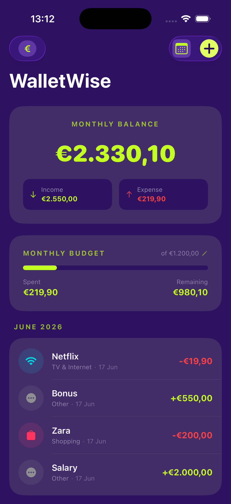
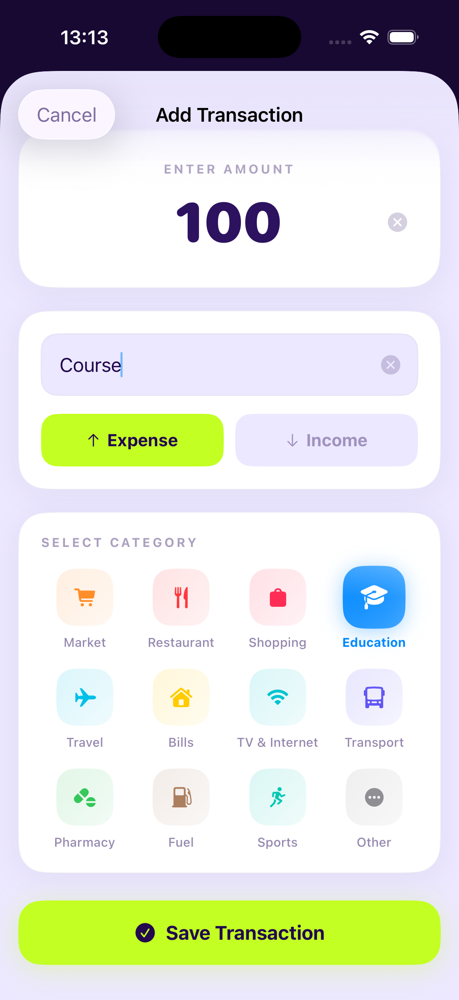
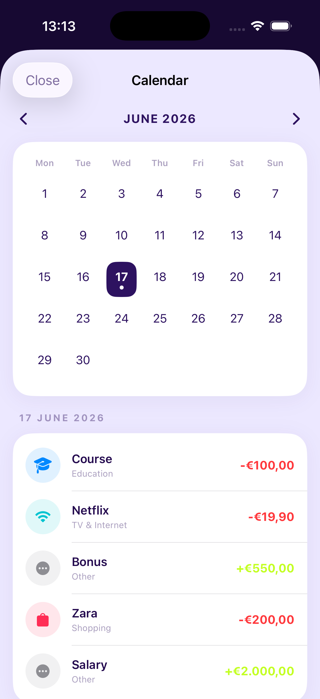
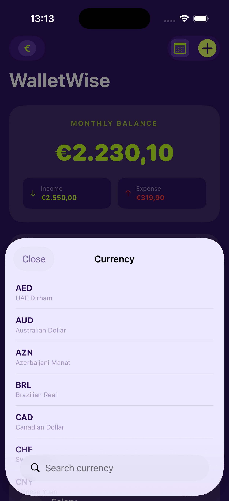

# WalletWise

Personal finance tracker built with SwiftUI and SwiftData.

## Demo

<div align="center">

<a href="https://youtube.com/shorts/piodfxxrGD8" target="_blank">
  
</a>

<br><br>

<a href="https://youtube.com/shorts/piodfxxrGD8" target="_blank">
  
</a>

</div>

## Screenshots

<div align="center">

&nbsp;&nbsp;&nbsp;

<br>

&nbsp;&nbsp;&nbsp;&nbsp;&nbsp;&nbsp;

</div>

## Features

- Track income and expenses with 12 categories
- Monthly budget with animated progress bar (green → orange → red)
- Calendar view for date-based transaction browsing
- 30 international currencies with instant switching
- Swipe-to-delete with haptic feedback
- Full VoiceOver accessibility

## Tech Stack

| Technology | Purpose |
|:-----------|:--------|
| **SwiftUI** | Declarative UI framework |
| **SwiftData** | On-device data persistence |
| **@Observable** | Reactive state management (MVVM) |
| **UserDefaults** | Lightweight settings storage |
| **[Stitch](https://stitch.withgoogle.com)** | UI/UX design and prototyping |

## Architecture

- **MVVM** with `@Observable` ViewModel
- **SOLID** — single responsibility per file
- **OOP** — class-based ViewModel with encapsulated logic
- Safe optional handling, `do/catch` error handling, no force unwraps

```
WalletWise/
├── Models/          # Transaction, Category, Currency
├── ViewModels/      # WalletViewModel (@Observable)
├── Views/           # HomeView, AddTransaction, Calendar, CurrencyPicker
│   └── Components/  # BalanceCard, ProgressRing, TransactionRow, SwipeableRow
├── Theme.swift      # Color palette
└── ContentView.swift
```

## Requirements

- iOS 17.0+ / Xcode 15.0+ / Swift 5.9+

## Installation

```bash
git clone https://github.com/aisel-mohbaliyeva/WalletWise.git
cd WalletWise
open WalletWise.xcodeproj
```

## Author

**Aysel Mohbaliyeva** — [@aisel-mohbaliyeva](https://github.com/aisel-mohbaliyeva)

## License

MIT License. See [LICENSE](LICENSE) for details.
